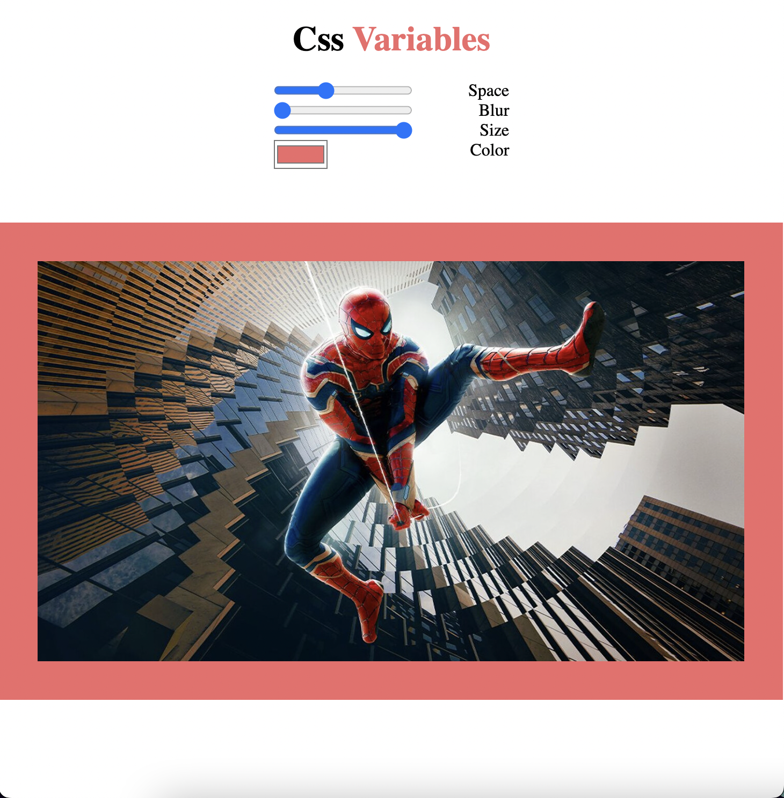

# Css Variables

**Proyecto para manipular variables css desde javascript**

- Manipula distinas propiedades de una imagen inscrustada

    - Padding (space) para dar un margen de color a la imagen

    - Blur para hacer borrosa la imagen

    - Size para manipular el tamaño de la imagen

    - Color para manipular el color de fondo de la imagen y de la palabra *Variables* en el titulo

- Utiliza solamente las tecnologías básicas de la web

    - Html

    - Css

    - Javascript

- En este proyecto se utiliza una arquitectura básica en la que todos los archivos están en el direcorio raíz

Puedes ver el resultado [aqui](https://raymundosantorski.github.io/cssvars/);

